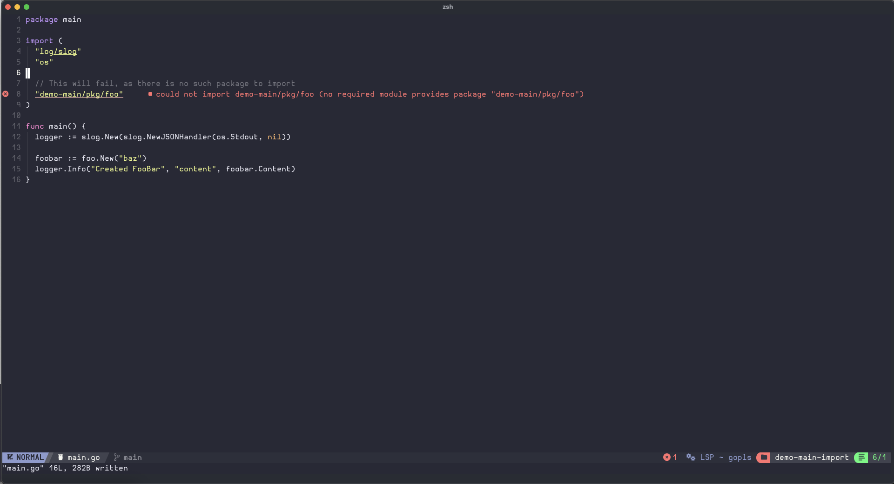
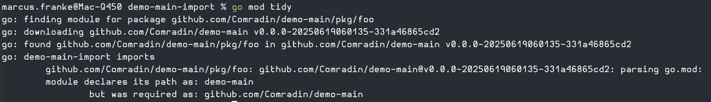

# Overview

This repository is a companion repo to the [demo-main](https://github.com/Comradin/demo-main) 
repository where I create a simple repository with a local package foo, which we will try
to import in this project.

> Hint: This will not work, as the project has no version control resolvable name

# Broken import

As you can see in the picture the LSP already claims that there is no module providing
the necessary code to satisfy the import statement.

# Broken import Part II

While one could consider fixing the import statement by correcting the import path
from "demo-main/pkg/foo" to the correct Github URL of "github.com/Comradin/demo-main/pkg/foo",
this will also not work, as the package name is "demo-main" and not like an _corrected_ path
could lead to assume.

Trying to import the package will result in the following error message:

